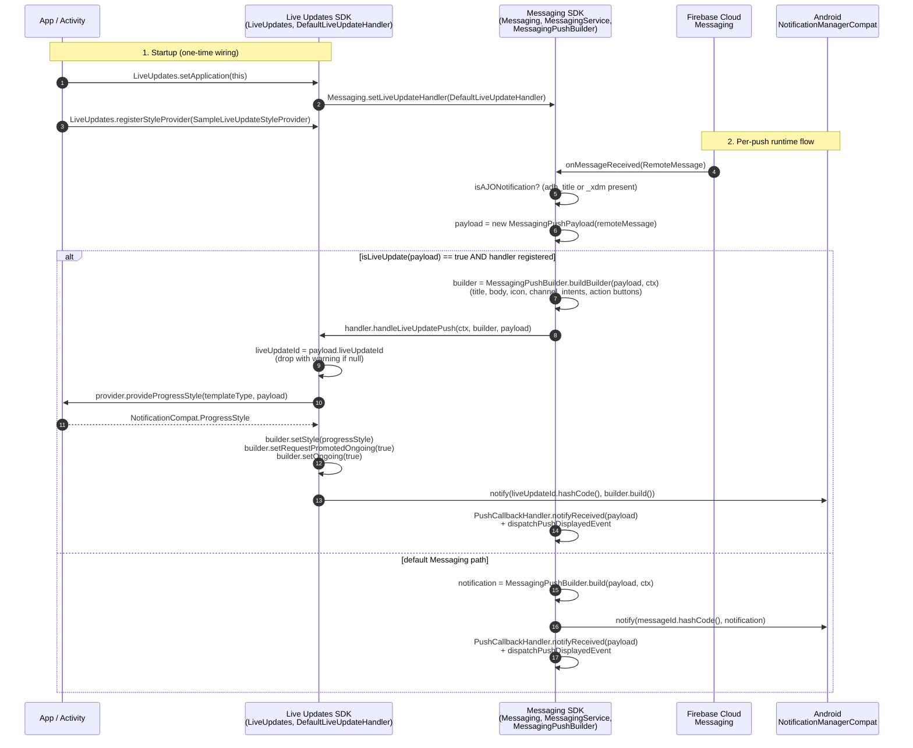

# Architecture — Approach 1, Part 2: `LiveUpdateHandler` in Messaging (implemented)

> Follow-up to `architecture-approach-1.md`. The original draft placed the
> `LiveUpdateHandler` interface in Core. This part-2 document records what was
> actually implemented and committed against `staging_liveupdate_1`: the
> interface and the registration both live in **Messaging**.

## What changed from Part 1

| Concern | Part 1 (rejected) | Part 2 (implemented) |
|---|---|---|
| Where does `LiveUpdateHandler` live? | Core (`com.adobe.marketing.mobile.LiveUpdateHandler` declared in core) | **Messaging** (`com.adobe.marketing.mobile.LiveUpdateHandler` declared in the messaging AAR) |
| Where does the `set/get` API live? | `MobileCore.setLiveUpdateHandler(...)` | `Messaging.setLiveUpdateHandler(...)` |
| What does the handler receive? | `Map<String, String> data, String messageId` (Core can't see Messaging types) | `NotificationCompat.Builder, MessagingPushPayload` directly |
| Reparse cost in Live Updates SDK? | Yes — Live Updates rebuilds `MessagingPushPayload` from the map | No — payload already parsed by Messaging |
| Does Messaging build the base notification? | Unclear (app-supplied builder considered) | **Yes** — `MessagingPushBuilder.buildBuilder(...)` returns a populated builder. Live Updates SDK then layers ProgressStyle / `setRequestPromotedOngoing` on top. |
| App's surface | `LiveUpdateStyleProvider.buildForTemplate(...)` returns full `NotificationCompat.Builder` | `LiveUpdateStyleProvider.provideProgressStyle(...)` returns just `ProgressStyle` |

### Why the move

The driving problem was the `Map<String, String>` parameter in the part-1 design. Core sits below Messaging in the dependency graph, so the interface in Core could not reference `MessagingPushPayload` — it had to fall back to passing raw FCM data. The Live Updates SDK then had to reparse the same map a second time.

Moving the interface to Messaging removes that constraint. Messaging already has `MessagingPushPayload` and `NotificationCompat.Builder` — both are passed through `LiveUpdateHandler.handleLiveUpdatePush(...)` with no reparse, no `Map` round-trip. The precedent already exists in Messaging: `Messaging.setPushNotificationListener(...)` is the same registration shape.

## What lives where in code (after publish)

| Artifact | Repo | Path | Version |
|---|---|---|---|
| `LiveUpdateHandler` (interface) | aepsdk-messaging-android | `messaging/src/main/java/com/adobe/marketing/mobile/LiveUpdateHandler.java` | 3.10.0 |
| `LiveUpdateHandlerStore` (volatile holder) | aepsdk-messaging-android | `messaging/src/main/java/com/adobe/marketing/mobile/messaging/LiveUpdateHandlerStore.kt` | 3.10.0 |
| `Messaging.setLiveUpdateHandler` / `getLiveUpdateHandler` | aepsdk-messaging-android | `messaging/src/phone/java/com/adobe/marketing/mobile/Messaging.java` | 3.10.0 |
| `MessagingPushPayload.getTemplateType()` / `getLiveUpdateId()` / `isLiveUpdate(...)` | aepsdk-messaging-android | `messaging/src/main/java/com/adobe/marketing/mobile/MessagingPushPayload.java` | 3.10.0 |
| `MessagingConstants.Push.PayloadKeys.TEMPLATE_TYPE` / `LIVE_UPDATE_ID` | aepsdk-messaging-android | `messaging/src/main/java/com/adobe/marketing/mobile/messaging/MessagingConstants.java` | 3.10.0 |
| `MessagingPushBuilder.buildBuilder(...)` (refactored alongside `build(...)`) | aepsdk-messaging-android | `messaging/src/main/java/com/adobe/marketing/mobile/messaging/MessagingPushBuilder.java` | 3.10.0 |
| `MessagingService.handleRemoteMessage` (Live Update branch) | aepsdk-messaging-android | `messaging/src/main/java/com/adobe/marketing/mobile/messaging/MessagingService.java` | 3.10.0 |
| `LiveUpdates` facade | aepsdk-liveupdates-android | `code/liveupdates/.../LiveUpdates.kt` | 1.0.0 |
| `LiveUpdateStyleProvider` interface | aepsdk-liveupdates-android | `code/liveupdates/.../LiveUpdateStyleProvider.kt` | 1.0.0 |
| `DefaultLiveUpdateHandler` | aepsdk-liveupdates-android | `code/liveupdates/.../DefaultLiveUpdateHandler.kt` | 1.0.0 |

Core (`com.adobe.marketing.mobile:core`) has **no functional changes** in part-2 — only the version bump (3.7.0 → 3.8.0) so that the messaging build verifiably pulls core from mavenLocal.

## New API surface (final)

```java
// Messaging — public
package com.adobe.marketing.mobile;

public interface LiveUpdateHandler {
    void handleLiveUpdatePush(
            @NonNull Context context,
            @NonNull NotificationCompat.Builder builder,
            @NonNull MessagingPushPayload payload);
}

public final class Messaging {
    public static void setLiveUpdateHandler(@Nullable LiveUpdateHandler handler);
    @Nullable public static LiveUpdateHandler getLiveUpdateHandler();
    // ... existing API unchanged
}

public class MessagingPushPayload {
    public @Nullable String getTemplateType();
    public @Nullable String getLiveUpdateId();
    public static boolean isLiveUpdate(@NonNull MessagingPushPayload payload);  // Phase-1 stub: returns true
    // ... existing API unchanged
}
```

```kotlin
// Live Updates SDK — public
package com.adobe.marketing.mobile.messaging.liveupdate

object LiveUpdates {
    fun setApplication(application: Application)
    fun registerStyleProvider(provider: LiveUpdateStyleProvider)
}

fun interface LiveUpdateStyleProvider {
    fun provideProgressStyle(
        templateType: String?,
        payload: MessagingPushPayload
    ): NotificationCompat.ProgressStyle?
}
```

## New push payload keys

| Key | Required for Live Updates? | Purpose |
|---|---|---|
| `adb_live_update_id` | yes | Stable id mirroring iOS Live Activity ID. Notification id = `liveUpdateId.hashCode()`. |
| `adb_template_type` | optional today, required in Phase 2 | Tells the app's `LiveUpdateStyleProvider` which template variant to render. Phase 2 also drives the classifier (`isLiveUpdate` will return `true` iff `template_type == "live_update"`). |

All existing AJO push keys (`adb_title`, `adb_body`, `adb_icon`, `adb_channel_id`, `adb_n_priority`, `adb_a_type`, `adb_uri`, `adb_act`, `adb_image`, etc.) still work — Messaging continues to populate them onto the builder via `MessagingPushBuilder.buildBuilder(...)` before handing off.

## Sequence diagram



## Behavioral guarantees

1. **One-directional toolchain**: Messaging stays at `compileSdk 34` (commons 3.x). Its bytecode never names `ProgressStyle` or `setRequestPromotedOngoing`. The `NotificationCompat.Builder` instance crosses the boundary as an object only — runtime resolves to the highest `core-ktx` (1.17), where both SDKs see the same class.
2. **Same-chip updates**: every push carrying `adb_live_update_id=X` posts with notification id `X.hashCode()`. Re-sending with the same `X` updates the existing chip in place rather than spawning a new one.
3. **Graceful degradation**: when no `LiveUpdateHandler` is registered, the Live Update push falls through to the existing Messaging path and renders as a normal ongoing notification (no chip promotion). When no `LiveUpdateStyleProvider` is registered, the SDK drops the push with a warning log rather than posting a broken notification.
4. **Future merge**: when Live Updates is folded into Messaging, the `Messaging.setLiveUpdateHandler` indirection becomes an internal hook (or disappears entirely — Messaging can call its own internal Live Update code directly). All app-side imports continue to work because the package `com.adobe.marketing.mobile.messaging.liveupdate` was chosen for exactly this reason.

## Phase 2 / open questions

Unchanged from part-1:

1. Tighten `isLiveUpdate` to `template_type == "live_update"`.
2. Add live-update lifecycle telemetry to Edge from the Live Updates SDK.
3. Process-death behavior — Live Update notification persists, but no further updates arrive until the app is relaunched and re-registers.
