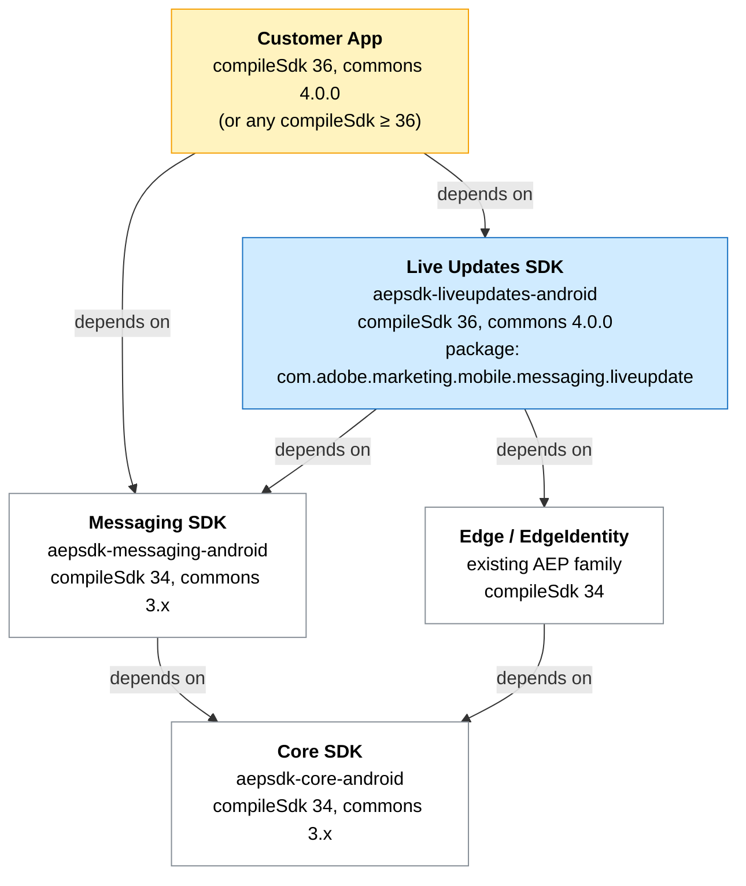
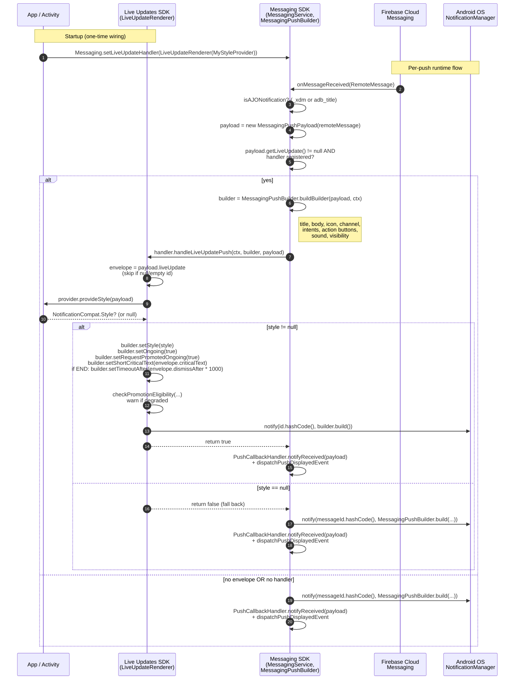

# Architecture — Live Updates SDK (Approach 1, Part 3)

Source-of-truth design doc for `aepsdk-liveupdates-android`. Supersedes parts 1 and 2
where they conflict.

---

## 1. Goals & design choices

| Goal | Why | How |
|---|---|---|
| Live Updates is **opt-in additive**; Core and Messaging stay at their existing toolchain (commons 3.x, compileSdk 34). | The new Live Update APIs (`ProgressStyle`, `setRequestPromotedOngoing`, `setShortCriticalText`) require core-ktx 1.17 / compileSdk 36 / AGP 8.9.1. Forcing that on every AEP consumer would propagate a major-version bump across the entire family. Live Updates is a feature — it should not drag everyone along. | The Live Updates SDK lives in its own AAR at commons 4.0.0. Messaging and Core only learn that *some* handler exists, never which class implements it. |
| **One-directional AAR coexistence** at compileSdk-36 consumers. | AAR-metadata enforcement (`checkAarMetadata`) is one-way: a 36-consumer can consume an older AAR, an older consumer cannot consume a 36 AAR. So we can build "downstream" on the new toolchain without breaking "upstream." | App targets compileSdk 36. Live Updates AAR built at compileSdk 36. Messaging/Core AARs continue to be built at compileSdk 34. App pulls all three; runtime classpath resolves to the highest `core-ktx` (1.17), at which point `NotificationCompat.Builder` is the same class for all SDKs. |
| **App owns styling; SDK owns chrome.** App never touches notification id, ongoing/promoted flags, channel choice, click intents, etc. | Style is genuinely app-domain (a flight vs a food delivery vs a sports score have different visual shapes). Chrome is platform-mechanics and identical across use cases. | App implements `LiveUpdateStyleProvider.provideStyle(payload): NotificationCompat.Style?` — one method, one input, one output. Everything else is the SDK's job. |
| **Style-agnostic SDK** — forward-compat to API 37+ (`MetricStyle`) and beyond. | Hardcoding "this SDK knows about ProgressStyle" locks us out of every future Android notification style. | The interface returns the base class `NotificationCompat.Style?`. SDK never casts, never inspects subtype, never validates. App returns whatever style the OS supports. |
| **Future merge into Messaging changes zero app imports.** | When/if Live Updates is folded into Messaging proper, customer apps shouldn't have to refactor. | Package is `com.adobe.marketing.mobile.messaging.liveupdate` — already nested under messaging's namespace. Merge moves source files only. |
| **Minimal public API surface.** | Every public symbol is a forever-cost. Avoid mutable singletons, avoid setApplication-style facades, prefer constructor-based wiring. | One-line app wiring: `Messaging.setLiveUpdateHandler(LiveUpdateRenderer(MyStyleProvider()))`. No `LiveUpdates.setApplication`, no `LiveUpdates.registerStyleProvider`. |
| **Clock-skew immunity in the payload schema.** | Device clocks drift (emulators especially). Absolute Unix timestamps in the payload caused ~60-second dismissal delays in testing. | Dismissal is expressed as `live_update_dismiss_after` (relative seconds from receipt), not `live_update_dismiss_at` (absolute Unix seconds). No device-clock arithmetic anywhere in the renderer. |
| **Graceful degradation** when the OS won't promote. | Not every device, channel, or style produces a chip. We should never crash or drop the push because of that. | When `Notification.hasPromotableCharacteristics()` / channel importance / API level / `canPostPromotedNotifications` checks fail, the renderer still posts — as a normal ongoing — and logs a clear diagnostic. |

---

## 2. Dependency structure



ASCII fallback for renderers without mermaid:

```
┌─────────────────────────────────────────────────────────┐
│  Customer App                                           │
│  compileSdk 36, commons 4.0.0 (or any compileSdk ≥ 36)  │
└─────────────────────┬───────────────────────────────────┘
                      │ depends on
                      ▼
┌─────────────────────────────────────────────────────────┐
│  Live Updates SDK   (aepsdk-liveupdates-android)        │
│  compileSdk 36, commons 4.0.0                           │
│  package:  com.adobe.marketing.mobile.messaging.liveupdate
└──────┬──────────────────────────────────────────┬───────┘
       │ depends on                               │ depends on
       ▼                                          ▼
┌──────────────────────────────┐    ┌──────────────────────────┐
│  Messaging SDK               │    │  Edge / EdgeIdentity     │
│  (aepsdk-messaging-android)  │    │  (existing AEP)          │
│  compileSdk 34, commons 3.x  │    │  compileSdk 34           │
└──────┬───────────────────────┘    └──────────┬───────────────┘
       │ depends on                            │
       ▼                                       ▼
┌─────────────────────────────────────────────────────────┐
│  Core SDK   (aepsdk-core-android)                       │
│  compileSdk 34, commons 3.x                             │
└─────────────────────────────────────────────────────────┘
```

**Key rule:** the arrow direction *cannot* be reversed. Messaging and Core MUST NOT depend on the Live Updates SDK. That would force them onto commons 4.0.0 and propagate the toolchain bump to every downstream AEP consumer.

**Runtime classpath collapse:** at runtime, only one version of each transitive dep wins. `androidx.core:core-ktx` resolves to 1.17.0 (pulled by Live Updates SDK; satisfies messaging's lower bound). `NotificationCompat.Builder` is therefore the same class type for all three SDKs at runtime, even though messaging's source code targets the older one.

---

## 2a. Future migration: when Live Updates folds into Messaging

When the Messaging SDK is eventually upgraded to commons 4.0.0 / compileSdk 36, the
Live Updates source files move from this repo into the messaging repo at the same
package path. From a customer's perspective, the migration is intentionally trivial.

### What the customer must change

**One change, in gradle only.** Drop the Live Updates dependency line; the classes are
now provided by messaging itself.

```diff
   implementation("com.adobe.marketing.mobile:messaging:<new-4.x-version>")
-  implementation("com.adobe.marketing.mobile:liveupdates:<1.x-version>")
```

A version bump on the existing messaging dep line will accompany the merge.

### What the customer does NOT change

| Aspect | Status post-merge |
|---|---|
| Source code imports | Unchanged — every FQCN stays identical (`com.adobe.marketing.mobile.messaging.liveupdate.*` and the messaging-level classes) |
| Class names | Unchanged |
| Method signatures | Unchanged |
| Wiring call | Unchanged: `Messaging.setLiveUpdateHandler(LiveUpdateRenderer(MyStyleProvider()))` still compiles as-is |
| Manifest entries | Unchanged |
| Notification channel registration | Unchanged |
| Server-side push payload schema | Unchanged |
| `LiveUpdateStyleProvider` implementation | Unchanged |

This is the payoff for choosing the `com.adobe.marketing.mobile.messaging.liveupdate`
package name in the initial scaffolding. The AAR that *provides* the classes is the only
thing that moves; the classes' fully-qualified names stay put.

### Why the dep removal is mandatory, not optional

If a customer accidentally keeps both AARs on the classpath after the merge, the D8 dexer
will fail at build time with a "Type ... is defined multiple times" error — both AARs
would contain `com.adobe.marketing.mobile.messaging.liveupdate.LiveUpdateRenderer` and
related classes at the same FQCN. So the error surfaces loudly at build time, never as
a silent runtime issue.

---

## 3. New public APIs

### Messaging adds

```java
package com.adobe.marketing.mobile;

// One-method public class — the contract Messaging hands the push to.
public interface LiveUpdateHandler {
    /**
     * @return true if this handler posted the notification; false to let Messaging
     *         render the push via its default (non-Live-Update) path.
     */
    boolean handleLiveUpdatePush(
        @NonNull Context context,
        @NonNull NotificationCompat.Builder builder,
        @NonNull MessagingPushPayload payload);
}

// Parsed envelope exposed to handlers + style providers.
public final class LiveUpdateEnvelope {
    public @NonNull  String     getId();              // mandatory
    public @NonNull  String     getTemplateType();    // defaults to "standard"
    public @NonNull  String     getEvent();           // defaults to "update"
    public @Nullable Long       getDismissAfter();    // seconds; only on END event
    public @Nullable String     getCriticalText();    // short status-bar chip text
    public @Nullable JSONObject getContentState();    // app-defined dynamic state
}

// Canonical template_type values. SDK does NOT validate against these.
public final class LiveUpdateTemplateType {
    public static final String PROGRESS  = "progress";   // NotificationCompat.ProgressStyle (API 36+)
    public static final String STANDARD  = "standard";   // no special style; basic ongoing
    public static final String CALL      = "call";       // NotificationCompat.CallStyle (API 31+, promotable 36+)
    public static final String METRIC    = "metric";     // NotificationCompat.MetricStyle (API 37+)
    public static final String BIG_TEXT  = "big_text";   // NotificationCompat.BigTextStyle
}

// Canonical event values.
public final class LiveUpdateEvent {
    public static final String START  = "start";
    public static final String UPDATE = "update";
    public static final String END    = "end";
}
```

### Messaging existing classes that gained methods

```java
public class Messaging {
    public static void setLiveUpdateHandler(@Nullable LiveUpdateHandler handler);
    public static @Nullable LiveUpdateHandler getLiveUpdateHandler();
    // ...rest unchanged
}

public class MessagingPushPayload {
    public @Nullable LiveUpdateEnvelope getLiveUpdate();   // lazily parsed, cached
    // ...rest unchanged
}
```

### Live Updates SDK adds

```kotlin
package com.adobe.marketing.mobile.messaging.liveupdate

// Functional interface — app's only required surface.
fun interface LiveUpdateStyleProvider {
    fun provideStyle(payload: MessagingPushPayload): NotificationCompat.Style?
}

// Canonical LiveUpdateHandler implementation. Constructor takes one argument; result is
// registered with Messaging in a single line.
class LiveUpdateRenderer(provider: LiveUpdateStyleProvider) : LiveUpdateHandler {
    // implementation detail; only the constructor is part of the public contract
}
```

### Public surface footprint

Messaging gains **1 interface** + **3 new classes** + **2 methods on existing classes**.
Live Updates SDK gains **1 class** + **1 fun interface**.
Total app-facing wiring: **one line**.

---

## 4. Integration path

### Build setup (gradle, app side)

```kotlin
dependencies {
    implementation("com.adobe.marketing.mobile:core:$mavenCoreVersion")
    implementation("com.adobe.marketing.mobile:messaging:$mavenMessagingVersion")
    implementation("com.adobe.marketing.mobile:edge:$mavenEdgeVersion")
    implementation("com.adobe.marketing.mobile:liveupdates:$mavenLiveUpdatesVersion")
    // ...other AEP family deps as needed (lifecycle, edgeidentity, assurance)
}
```

`compileSdk = 36`, `minSdk = 21`. The Live Updates AAR's `minCompileSdk = 36` metadata
will refuse to be consumed by an app at compileSdk < 36 — that's intentional, since the
chip styling APIs don't exist below 36.

### Manifest (app side)

```xml
<application
    android:name=".MyApplication"
    ...>

    <activity android:name=".MainActivity" ... />

    <!-- Messaging SDK's FCM entry point — unchanged from any AEP messaging app. -->
    <service
        android:name="com.adobe.marketing.mobile.messaging.MessagingService"
        android:enabled="true"
        android:exported="false">
        <intent-filter>
            <action android:name="com.google.firebase.MESSAGING_EVENT" />
        </intent-filter>
    </service>

</application>
```

`POST_NOTIFICATIONS` and `POST_PROMOTED_NOTIFICATIONS` permissions are declared by the
Live Updates AAR's manifest and merge in automatically.

### Application.onCreate (app side)

```kotlin
class MyApplication : Application() {
    override fun onCreate() {
        super.onCreate()

        MobileCore.setApplication(this)
        MobileCore.setLogLevel(LoggingMode.VERBOSE)
        MobileCore.setSmallIconResourceID(R.drawable.ic_notification)

        val extensions = listOf(
            Messaging.EXTENSION,
            Identity.EXTENSION,
            Lifecycle.EXTENSION,
            Edge.EXTENSION,
            Assurance.EXTENSION,
        )
        MobileCore.registerExtensions(extensions) {
            MobileCore.configureWithAppID("YOUR_APP_ID")
        }

        // The only Live Updates wiring — one line.
        Messaging.setLiveUpdateHandler(LiveUpdateRenderer(MyStyleProvider()))
    }
}
```

### The app's `LiveUpdateStyleProvider`

```kotlin
class MyStyleProvider : LiveUpdateStyleProvider {
    override fun provideStyle(payload: MessagingPushPayload): NotificationCompat.Style? {
        val envelope = payload.liveUpdate ?: return null
        val state = envelope.contentState

        return when (envelope.templateType) {
            LiveUpdateTemplateType.PROGRESS -> {
                val progress = state?.optDouble("journeyProgress", 0.0)?.toInt() ?: 0
                NotificationCompat.ProgressStyle()
                    .setProgress(progress)
                    .setStyledByProgress(true)
            }
            LiveUpdateTemplateType.BIG_TEXT -> NotificationCompat.BigTextStyle()
                .bigText(payload.body)
            // CALL, METRIC, STANDARD, or app-specific types handled here as needed.
            else -> null
        }
    }
}
```

Domain semantics ("is this a flight vs a food delivery?") live entirely inside `contentState`.
The SDK never sees that distinction.

### Notification channel

The app must register a `NotificationChannel` with `IMPORTANCE_HIGH` matching the
`adb_channel_id` the server sends in the payload. Without a HIGH-importance channel the
notification will post but NOT be promoted to a chip. The SDK logs a clear warning when
this happens (see eligibility check in section 5).

---

## 5. Flow

### Sequence diagram (mermaid — renders in GitHub/Cursor/IntelliJ)



### ASCII alternative

```
[App onCreate] ── Messaging.setLiveUpdateHandler(LiveUpdateRenderer(MyStyleProvider))

──────────────────────────────────────────────────────────────────────────

[FCM] ── RemoteMessage ──► MessagingService.onMessageReceived
                                  │
                                  ▼
                            isAJONotification?  (_xdm or adb_title)
                                  │ yes
                                  ▼
                            payload = new MessagingPushPayload(remoteMessage)
                                  │
                                  ▼
                            getLiveUpdate() != null && handler != null?
                                  │
                                  ▼ yes
                            builder = MessagingPushBuilder.buildBuilder(payload, ctx)
                                  │
                                  ▼
                            handler.handleLiveUpdatePush(ctx, builder, payload)  → boolean
                                  │
                                  ▼
                            envelope = payload.liveUpdate
                            style = provider.provideStyle(payload)
                                  │
                          ┌───────┴────────┐
                       null               non-null
                          │                  │
                  return false         builder.setStyle(style)
                  (fall back)          builder.setOngoing(true)
                                       builder.setRequestPromotedOngoing(true)
                                       builder.setShortCriticalText(envelope.criticalText)
                                       (END only) builder.setTimeoutAfter(envelope.dismissAfter * 1000)
                                              │
                                              ▼
                                       checkPromotionEligibility(...) → warn if degraded
                                              │
                                              ▼
                                       notify(id.hashCode(), notification)
                                       return true
```

---

## 6. Payload example

### Full FCM v1 message body

```json
{
  "message": {
    "token": "<FCM_TOKEN>",
    "android": { "priority": "HIGH" },
    "data": {
      "_xdm": "{...AJO xdm metadata...}",

      "adb_title":      "Flight DL241",
      "adb_body":       "Boarding now at Gate D22",
      "adb_channel_id": "live_updates_channel",
      "adb_n_priority": "PRIORITY_HIGH",

      "adb_live_update_data": "<JSON string of the envelope below>"
    }
  }
}
```

### Envelope (the JSON string value of `adb_live_update_data`)

```json
{
  "live_update_id":            "flight_DL241_2026_01_15",
  "live_update_template_type": "progress",
  "live_update_event":         "start",
  "live_update_critical_text": "30 min",
  "live_update_content_state": {
    "journeyProgress":  10.0,
    "arrivalAirport":   "MUM",
    "departureAirport": "DEL",
    "arrivalTerminal":  "Terminal D"
  }
}
```

### Update envelope

```json
{
  "live_update_id":            "flight_DL241_2026_01_15",
  "live_update_template_type": "progress",
  "live_update_event":         "update",
  "live_update_critical_text": "10 min",
  "live_update_content_state": {
    "journeyProgress":  75.0
  }
}
```

Sending this re-`notify`s the same notification id (`liveUpdateId.hashCode()`), updating
the chip in place.

### End envelope (with auto-dismiss)

```json
{
  "live_update_id":            "flight_DL241_2026_01_15",
  "live_update_template_type": "progress",
  "live_update_event":         "end",
  "live_update_dismiss_after": 5,
  "live_update_critical_text": "Done",
  "live_update_content_state": {
    "journeyProgress":  100.0
  }
}
```

`live_update_dismiss_after = 5` means: cancel the notification 5 seconds after it lands
on the device. Relative duration — no device-clock arithmetic — clock-skew immune.

### Payload key reference

| Top-level FCM data key | Required for Live Update? | Source | Used by |
|---|---|---|---|
| `_xdm` (or `adb_title`) | yes (one of) | AJO server | satisfies `isAJONotification` gate |
| `adb_title`, `adb_body`, `adb_icon`, `adb_channel_id`, `adb_n_priority`, `adb_image`, `adb_act`, ... | optional (any AJO push key) | AJO server | `MessagingPushBuilder.buildBuilder` populates them |
| `adb_live_update_data` | **yes** for Live Update path | AJO server | parsed into `LiveUpdateEnvelope` |

| Envelope key | Required? | Defaults to | Drives |
|---|---|---|---|
| `live_update_id` | **yes** | — | notification id = `id.hashCode()`; envelope is `null` if missing |
| `live_update_template_type` | optional | `"standard"` | app's switch in `provideStyle` |
| `live_update_event` | optional | `"update"` | phase-2 telemetry; END triggers `setTimeoutAfter` |
| `live_update_dismiss_after` | optional, only honored on END | — | `builder.setTimeoutAfter(seconds * 1000)` |
| `live_update_critical_text` | optional | — | `builder.setShortCriticalText(...)` — short status-bar chip text |
| `live_update_content_state` | optional | — | app-defined JSON object; SDK exposes raw, app parses |

---

## 7. Things to remember (gotchas, future work, divergences)

### Same `live_update_id` after END recreates a fresh chip

Android's `NotificationManager.notify(id, ...)` is stateless — it doesn't track which ids
were previously used. After an END notification is dismissed (auto-dismissed, user-swiped,
or app-cancelled), sending another push with the same `live_update_id` will post a fresh
notification with that id.

**Diverges from iOS Live Activities**, which silently drop updates to an ended activity id.

Two ways to add iOS-like behavior if it becomes a requirement:

- **SDK-side ended-id tracking** — `LiveUpdateRenderer` keeps a set of ended ids (in-memory
  or persisted to `SharedPreferences`) and returns `false` from `handleLiveUpdatePush` for
  subsequent pushes to those ids. Adds state, needs persistence to survive process death,
  needs a TTL/cleanup policy.
- **App-side gating** — the app's `LiveUpdateStyleProvider` consults its own domain state
  (order delivered, flight landed, etc.) and returns `null` to refuse. SDK stays stateless.

Leaning toward the app-side approach when we get to this — apps usually already track
domain lifecycle, no need for the SDK to maintain a parallel "ended" set.

### Why `dismiss_after` (relative) and not `dismiss_at` (absolute)

Initial schema mirrored APNS's `dismissal-date` (absolute Unix seconds). Testing on an
emulator with a clock that was ~60 seconds behind the host caused dismissals to fire ~60
seconds late. Diagnosis: the renderer was computing `dismissAt * 1000 - System.currentTimeMillis()` —
operands from two different clocks.

Two fixes considered:
- Compute relative duration from both server-side timestamps (`dismissAt - timestamp`)
  inside the renderer. Works, but keeps two redundant fields in the payload.
- Drop both absolute fields entirely; send `live_update_dismiss_after` as a relative
  duration. Simpler, schema is honest about what it needs.

Chose the second. The Android renderer never reads `System.currentTimeMillis()`.

### `setTimeoutAfter` works on promoted ongoing notifications

Earlier incorrect diagnosis: "setTimeoutAfter is silently ignored on promoted ongoing."
This was wrong — it worked all along, just with a 60-second delay due to the clock skew
above. After the schema fix, `setTimeoutAfter(seconds * 1000)` is sufficient.

The system schedules the cancel internally, so it survives FCM service process death
(unlike `Handler.postDelayed`).

### Promotion eligibility — graceful degradation, never crash

The renderer pre-checks `Notification.hasPromotableCharacteristics()`, channel importance
≥ `IMPORTANCE_HIGH`, `NotificationManager.canPostPromotedNotifications()`, and
`Build.VERSION.SDK_INT >= 36` before posting. Any failure logs a specific reason. The
notification posts regardless — degrades to a normal ongoing instead of a chip.

Common reasons in the wild:
- Channel registered with default importance instead of HIGH
- Device is API 35 or older
- User disabled "Live Updates" / promoted notifications in OS settings
- Style chosen is not on the OS's promotion-eligible list (e.g. plain `BigTextStyle`)

### `MessagingPushPayload.isLiveUpdate()` was removed

Earlier API; the gate is now `payload.getLiveUpdate() != null`. One method instead of two.
The phase-1 stub that returned `true` unconditionally is gone — gating is now purely
"did the envelope parse with a non-empty id?"

### Phase 2 placeholders

- **Live Update lifecycle telemetry to Edge** — emit `live_update.started`, `.updated`,
  `.ended` events from the renderer based on `envelope.event`. Currently not implemented.
- **Process-death survival** for the auto-dismiss path is handled by `setTimeoutAfter`. If
  future logic adds *more* deferred work (e.g. delayed metric uploads), it'll need
  `WorkManager`.
- **Schema tightening** — `isLiveUpdate` will eventually look at `template_type == "live_update"`
  too, not just envelope presence. Deferred until we have a real server-side schema spec.

### Future merge into Messaging

When/if Live Updates is folded into the Messaging SDK, the move is:

1. Source files move from `code/liveupdates/src/main/java/com/adobe/marketing/mobile/messaging/liveupdate/`
   into the messaging repo at the same package path.
2. Messaging's `compileSdk` bumps from 34 → 36 (the toolchain bump that started all this).
3. `Messaging.setLiveUpdateHandler(...)` registration becomes an internal hook, or
   Messaging calls the renderer directly without going through the indirection.
4. App imports do **not** change. `com.adobe.marketing.mobile.messaging.liveupdate.*`
   resolves to the same classes, just inside a different AAR.

### Non-goals (explicitly out of scope)

- Local-only Live Updates (no FCM round trip). Possible to bolt on later by exposing
  `LiveUpdateRenderer.handleLiveUpdatePush(...)` for direct invocation, but not needed today.
- Wear OS / Auto / TV-specific rendering paths.
- Custom Live Update styles beyond what Android's `NotificationCompat.Style` subclasses support.
- Server-side payload schema validation. The SDK accepts whatever parses.

---

## Appendix: file-level reference

| Component | Repo | Path |
|---|---|---|
| `LiveUpdateHandler` interface | aepsdk-messaging-android | `code/messaging/src/main/java/com/adobe/marketing/mobile/LiveUpdateHandler.java` |
| `LiveUpdateEnvelope` | aepsdk-messaging-android | `code/messaging/src/main/java/com/adobe/marketing/mobile/LiveUpdateEnvelope.java` |
| `LiveUpdateTemplateType`, `LiveUpdateEvent` | aepsdk-messaging-android | `code/messaging/src/main/java/com/adobe/marketing/mobile/` |
| `LiveUpdateHandlerStore` (internal) | aepsdk-messaging-android | `code/messaging/src/main/java/com/adobe/marketing/mobile/messaging/LiveUpdateHandlerStore.kt` |
| `Messaging.setLiveUpdateHandler` / `getLiveUpdateHandler` | aepsdk-messaging-android | `code/messaging/src/phone/java/com/adobe/marketing/mobile/Messaging.java` |
| `MessagingPushPayload.getLiveUpdate` | aepsdk-messaging-android | `code/messaging/src/main/java/com/adobe/marketing/mobile/MessagingPushPayload.java` |
| `MessagingConstants.Push.PayloadKeys.LIVE_UPDATE_DATA` | aepsdk-messaging-android | `code/messaging/src/main/java/com/adobe/marketing/mobile/messaging/MessagingConstants.java` |
| `MessagingService.handleRemoteMessage` (Live Update branch) | aepsdk-messaging-android | `code/messaging/src/main/java/com/adobe/marketing/mobile/messaging/MessagingService.java` |
| `LiveUpdateRenderer` | aepsdk-liveupdates-android | `code/liveupdates/src/main/java/com/adobe/marketing/mobile/messaging/liveupdate/LiveUpdateRenderer.kt` |
| `LiveUpdateStyleProvider` | aepsdk-liveupdates-android | `code/liveupdates/src/main/java/com/adobe/marketing/mobile/messaging/liveupdate/LiveUpdateStyleProvider.kt` |

### Current versions

- `com.adobe.marketing.mobile:core:3.8.0`
- `com.adobe.marketing.mobile:messaging:3.10.0`  (carries Live Update interface + envelope + handler dispatch)
- `com.adobe.marketing.mobile:liveupdates:1.0.0`  (this repo)
