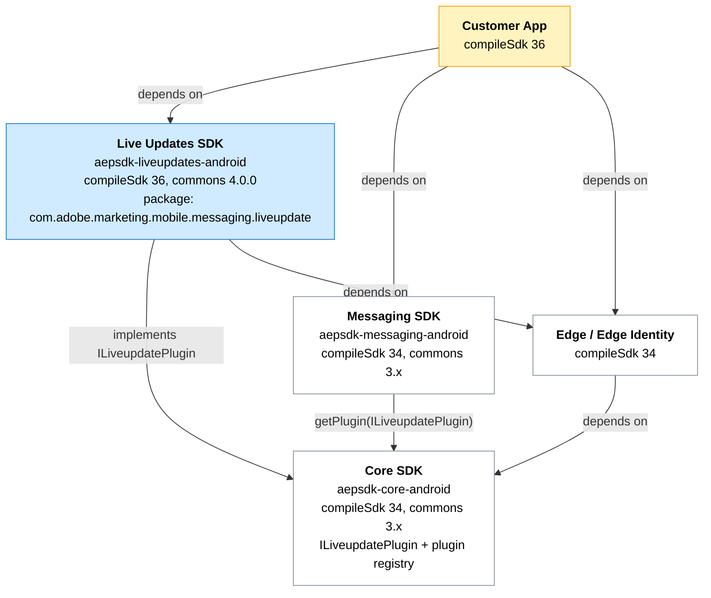
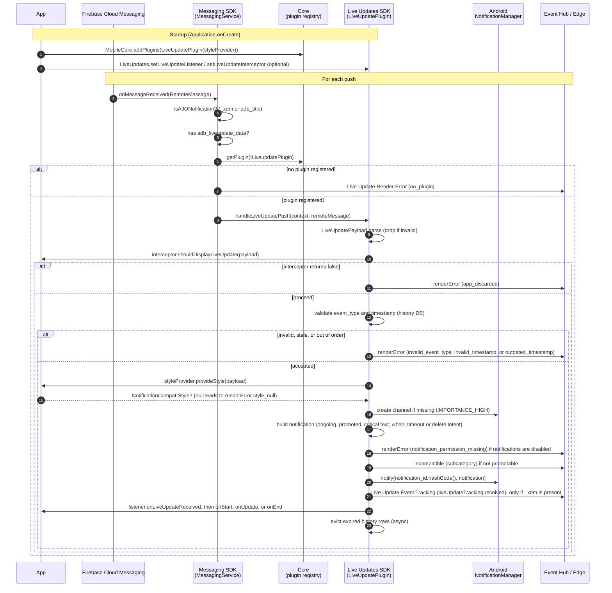
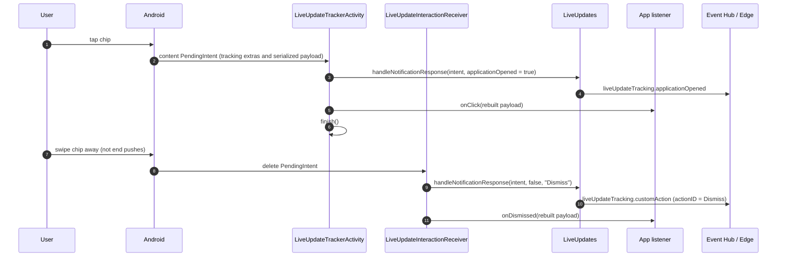

# Architecture - Live Updates SDK

The design document for `aepsdk-liveupdates-android`. For integration instructions, see the [developer documentation](./README.md).

---

## 1. Goals and design choices

| Goal | Why | How |
|---|---|---|
| **Live Updates are opt-in and additive.** Core and Messaging stay on their existing toolchain (commons 3.x, compileSdk 34). | The Live Update APIs (`ProgressStyle`, `setRequestPromotedOngoing`, `setShortCriticalText`) require `androidx.core` 1.17 / compileSdk 36 / AGP 8.9.1. Forcing that on every AEP consumer would propagate a major toolchain bump across the whole SDK family. | Live Updates ship in their own AAR, built with commons 4.0.0 (compileSdk 36). Only apps that add this AAR need compileSdk 36. |
| **One-directional AAR compatibility.** | AAR metadata checks are one-way: an app at compileSdk 36 can use AARs built at 34, but an app at 34 cannot use an AAR built at 36. | The app and the Live Updates AAR use compileSdk 36. The Core and Messaging AARs stay at 34. At runtime, `androidx.core` resolves to 1.17.0, so `NotificationCompat.Builder` is the same class for every SDK. |
| **No compile-time dependency between Messaging and Live Updates.** | Messaging must not depend on a compileSdk 36 AAR, and Live Updates should not be tied to Messaging internals. | Both depend on Core's plugin contract (`ILiveupdatePlugin`). The app registers `LiveUpdatePlugin` with `MobileCore.addPlugins`, and Messaging looks it up with `MobileCore.getPlugin`. The push is passed as `Any`, so Core does not depend on Firebase. |
| **The app owns styling; the SDK owns everything else.** | Styling depends on the use case: a flight, a delivery, and a sports score look different. The notification id, channel, ongoing and promotion flags, intents, and tracking work the same for every use case. | The app implements `ILiveUpdateStyleProvider.provideStyle(payload): NotificationCompat.Style?`. The SDK does everything else. |
| **The SDK does not depend on specific notification styles,** so it keeps working with API 37+ styles such as `MetricStyle`. | Building in knowledge of specific styles would exclude future Android notification styles. | The provider returns the base type `NotificationCompat.Style?`. The SDK never casts, inspects, or validates it. |
| **A small public API.** | Every public symbol has to be maintained indefinitely. | Required wiring is one line: `MobileCore.addPlugins(LiveUpdatePlugin(MyStyleProvider()))`. The listener and interceptor are optional. |
| **Timing that does not depend on the device clock.** | Device clocks drift, especially on emulators. Absolute dismissal times delayed dismissals by about 60 seconds in testing. | Dismissal uses `dismiss_after`, a duration relative to when the end push arrives. `timestamp` is compared only with earlier timestamps from the server for ordering, plus a coarse 28-day staleness check. |
| **Ordered, idempotent processing.** | FCM can deliver pushes late, more than once, or out of order. | Each accepted `timestamp` is stored per (`notification_id`, `notification_channel_id`). A push with an older or equal timestamp is dropped. |
| **Degrade without failing** when the system won't promote the notification. | Not every device, channel, or style can produce a chip, and that should never cause a crash or a dropped push. | The SDK still posts the notification as a regular ongoing notification, logs the reason, and dispatches an `incompatible` diagnostic event. |
| **Tracking parity with iOS Live Activities.** | AJO reporting should work without new schema work. | Tracking uses the AJO push tracking XDM, with channel `https://ns.adobe.com/xdm/channels/liveactivity` and `pushChannelContext.liveActivity`. |
| **Not a `MobileCore` extension.** | The SDK only needs to send events. It does not need extension lifecycle or shared state. | The SDK is a plain library. It dispatches events with `MobileCore.dispatchEvent`, and its only Event Hub listener caches `messaging.eventDataset` from configuration. |

---

## 2. Dependency structure


```mermaid
flowchart TB
    App["<b>Customer App</b><br/>compileSdk 36"]

    LU["<b>Live Updates SDK</b><br/>aepsdk-liveupdates-android<br/>compileSdk 36, commons 4.0.0<br/>package: com.adobe.marketing.mobile.messaging.liveupdate"]

    Msg["<b>Messaging SDK</b><br/>aepsdk-messaging-android<br/>compileSdk 34, commons 3.x"]

    Edge["<b>Edge / Edge Identity</b><br/>compileSdk 34"]

    Core["<b>Core SDK</b><br/>aepsdk-core-android<br/>compileSdk 34, commons 3.x<br/>ILiveupdatePlugin + plugin registry"]

    App -->|depends on| LU
    App -->|depends on| Msg
    App -->|depends on| Edge
    LU -->|implements ILiveupdatePlugin| Core
    LU -->|depends on| Edge
    Msg -->|"getPlugin(ILiveupdatePlugin)"| Core
    Edge -->|depends on| Core

    classDef new fill:#d0ebff,stroke:#1971c2,color:#000
    classDef existing fill:#fff,stroke:#868e96,color:#000
    classDef app fill:#fff3bf,stroke:#f59f00,color:#000
    class App app
    class LU new
    class Msg,Edge,Core existing
```

- **Live Updates** depends on Core and Edge (`implementation`), `androidx.core:core-ktx` 1.17.0, and `firebase-messaging` (`compileOnly`, so the app provides it).
- **Live Updates and Messaging do not depend on each other at compile time.** They connect at runtime through Core's plugin registry. `LiveUpdatesConstants.LIVE_UPDATE_DATA_KEY` intentionally duplicates Messaging's `adb_liveupdate_data` key so that no compile-time dependency is needed.
- **Key rule:** Core and Messaging must never depend on the Live Updates SDK. That would force them onto commons 4.0.0 and pass the toolchain bump on to every AEP consumer.

---

## 3. Plugin contract

Core 3.10.0 provides the following:

```kotlin
package com.adobe.marketing.mobile.plugin

interface IAepPlugin

interface ILiveupdatePlugin : IAepPlugin {
    fun handleLiveUpdatePush(context: Context, message: Any)
}
```

It also provides `MobileCore.addPlugins(vararg IAepPlugin)` and `MobileCore.getPlugin(Class<T>)`.

Messaging 3.13.0 handles Live Updates in `MessagingService.handleRemoteMessage(context, remoteMessage)`:

1. If the message is not an AJO push (it has neither `_xdm` nor `adb_title`), it returns `false`.
2. If the message data contains `adb_liveupdate_data`:
   - If an `ILiveupdatePlugin` is registered, it calls `handleLiveUpdatePush(context, remoteMessage)`.
   - Otherwise, it logs a warning and dispatches a `Live Update Render Error` event with subcategory `no_plugin`.
   - In both cases it returns `true`.
3. Otherwise, it displays the push through the standard Messaging path.

Messaging never reads inside `adb_liveupdate_data`.

---

## 4. Components

| Class | Visibility | Responsibility |
|---|---|---|
| `LiveUpdatePlugin` | Public | The `ILiveupdatePlugin` implementation. Validates the payload, calls the style provider, builds and posts the notification, checks promotion eligibility, and starts tracking and listener dispatch. |
| `LiveUpdates` | Public object | The public entry point. Registers the listener and interceptor, triggers local Live Updates, provides manual-mode tracking (`trackLiveUpdateEvent`, `addPushTrackingDetails`, `handleNotificationResponse`) and topic tracking. Builds and dispatches all tracking and diagnostic events. |
| `LiveUpdatePayload` | Public | The typed, parsed envelope (`parse`, `isLiveUpdate`, `create`). Also serializes itself onto interaction intents so it can be rebuilt after the process dies. |
| `ILiveUpdateStyleProvider` | Public | The app's styling hook. Required. |
| `ILiveUpdateListener` | Public | App callbacks: `onLiveUpdateReceived`, `onStart`, `onUpdate`, `onEnd`, `onClick`, `onDismissed`. Optional. |
| `ILiveUpdateInterceptor` | Public | Lets the app drop a Live Update before it is rendered. Optional. |
| `LiveUpdateTrackerActivity` | Declared in the SDK manifest | A transparent activity that is the chip's content intent. Dispatches `applicationOpened` tracking, calls `onClick`, and finishes immediately. |
| `LiveUpdateInteractionReceiver` | Declared in the SDK manifest | The chip's delete intent. Dispatches `customAction`/`Dismiss` tracking and calls `onDismissed`. |
| `NotificationHistoryManager` | Internal | Validates timestamps, keeps the local-start registry, and evicts expired rows. Runs database work on a single background thread. |
| `NotificationHistoryDatabase` | Internal | SQLite storage, using Core's `SQLiteDatabaseHelper`. |
| `LiveUpdateListenerStore` | Internal | Holds the listener in a volatile field. |
| `LiveUpdatesConstants` | Internal | The log tag (`LiveUpdates`) and the `adb_liveupdate_data` key. |

---

## 5. Runtime flow

### Push received


```mermaid
sequenceDiagram
    autonumber
    participant App as App
    participant FCM as Firebase Cloud Messaging
    participant Msg as Messaging SDK<br/>(MessagingService)
    participant Core as Core<br/>(plugin registry)
    participant LU as Live Updates SDK<br/>(LiveUpdatePlugin)
    participant OS as Android<br/>NotificationManager
    participant Hub as Event Hub / Edge

    Note over App,LU: Startup (Application.onCreate)
    App->>Core: MobileCore.addPlugins(LiveUpdatePlugin(styleProvider))
    App->>LU: LiveUpdates.setLiveUpdateListener / setLiveUpdateInterceptor (optional)

    Note over FCM,Hub: For each push
    FCM->>Msg: onMessageReceived(RemoteMessage)
    Msg->>Msg: isAJONotification? (_xdm or adb_title)
    Msg->>Msg: has adb_liveupdate_data?
    Msg->>Core: getPlugin(ILiveupdatePlugin)
    alt no plugin registered
        Msg->>Hub: Live Update Render Error (no_plugin)
    else plugin registered
        Msg->>LU: handleLiveUpdatePush(context, remoteMessage)
        LU->>LU: LiveUpdatePayload.parse (drop if invalid)
        LU->>App: interceptor.shouldDisplayLiveUpdate(payload)
        alt interceptor returns false
            LU->>Hub: renderError (app_discarded)
        else proceed
            LU->>LU: validate event_type and timestamp (history DB)
            alt invalid, stale, or out of order
                LU->>Hub: renderError (invalid_event_type, invalid_timestamp, or outdated_timestamp)
            else accepted
                LU->>App: styleProvider.provideStyle(payload)
                App-->>LU: NotificationCompat.Style? (null leads to renderError style_null)
                LU->>OS: create channel if missing (IMPORTANCE_HIGH)
                LU->>LU: build notification (ongoing, promoted, critical text, when, timeout or delete intent)
                LU->>Hub: renderError (notification_permission_missing) if notifications are disabled
                LU->>Hub: incompatible (subcategory) if not promotable
                LU->>OS: notify(notification_id.hashCode(), notification)
                LU->>Hub: Live Update Event Tracking (liveUpdateTracking.received), only if _xdm is present
                LU->>App: listener.onLiveUpdateReceived, then onStart, onUpdate, or onEnd
                LU->>LU: evict expired history rows (async)
            end
        end
    end
```

### Interactions


```mermaid
sequenceDiagram
    autonumber
    participant User
    participant OS as Android
    participant Tracker as LiveUpdateTrackerActivity
    participant Receiver as LiveUpdateInteractionReceiver
    participant LU as LiveUpdates
    participant App as App listener
    participant Hub as Event Hub / Edge

    User->>OS: tap chip
    OS->>Tracker: content PendingIntent (tracking extras and serialized payload)
    Tracker->>LU: handleNotificationResponse(intent, applicationOpened = true)
    LU->>Hub: liveUpdateTracking.applicationOpened
    Tracker->>App: onClick(rebuilt payload)
    Tracker->>Tracker: finish()

    User->>OS: swipe chip away (not end pushes)
    OS->>Receiver: delete PendingIntent
    Receiver->>LU: handleNotificationResponse(intent, false, "Dismiss")
    LU->>Hub: liveUpdateTracking.customAction (actionID = Dismiss)
    Receiver->>App: onDismissed(rebuilt payload)
```

The SDK never opens an app screen. Choosing what to open is the app's responsibility in `onClick`.

### Integration patterns

| Pattern | Entry point | Rendering |
|---|---|---|
| Automatic | Messaging's `MessagingService` declared in the app manifest | `LiveUpdatePlugin` |
| Mixed | The app's `FirebaseMessagingService` calls `MessagingService.handleRemoteMessage` | `LiveUpdatePlugin` |
| Manual | The app's `FirebaseMessagingService` | The app, using `LiveUpdates.trackLiveUpdateEvent`, `addPushTrackingDetails`, and `handleNotificationResponse` for tracking |
| Local | `LiveUpdates.triggerLocalLiveUpdate(context, payload)` with `event_type = localstart` | `LiveUpdatePlugin` (requires the built-in plugin) |

---

## 6. Payload

The FCM data contains `adb_liveupdate_data`, the JSON envelope, and `_xdm`, the AJO tracking data. The required envelope keys are `notification_id`, `notification_channel_id`, `event_type`, and `timestamp` (epoch seconds). The optional keys are `title`, `body`, `priority`, `critical_text`, `when`, `dismiss_after`, `content_state`, `topic_name`, and `small_icon`.

The full key reference and examples are in the [payload reference](./sources/payload.md).

The envelope root holds fields the SDK uses. `content_state` holds app-defined state that only the style provider reads. Use-case details, such as whether a Live Update is a flight or a delivery, stay inside `content_state`.

---

## 7. Persistence

`NotificationHistoryDatabase` is a SQLite database named `com.adobe.module.liveupdates.notificationhistory`, stored in the app's database directory. It has two tables:

| Table | Columns | Purpose |
|---|---|---|
| `notification_history` | `notificationId`, `channelId` (primary key), `timestamp` (epoch seconds), `expiresAt` (`timestamp` + 28 days) | The last accepted timestamp for each Live Update. Used to drop duplicate and out-of-order pushes. |
| `local_started_live_updates` | `notificationId`, `channelId` (primary key), `eventTimestamp` (epoch milliseconds) | Live Updates started locally whose start has not been reported yet. An entry is removed when the catch-up event is dispatched. |

- All database work runs on a single background thread.
- Database failures never block rendering: timestamp checks proceed as if accepted, and local-start lookups return nothing.
- Expired rows are evicted asynchronously after each notification is posted.

The database uses Core's `SQLiteDatabaseHelper`, which is in Core's `internal.util` package and is not a supported public API. It is used until Core provides a public alternative.

---

## 8. Tracking

All tracking is dispatched as Edge request events named `Live Update Event Tracking`. The XDM uses the AJO push tracking format:

- `eventType` is `liveUpdateTracking.received`, `.applicationOpened`, `.customAction`, or `.topic`.
- `pushNotificationTracking` contains `pushProvider: fcm` and `pushProviderMessageID`.
- The push's `_xdm` is merged in, with its `mixins` or `cjm` contents flattened to the root.
- `_experience.customerJourneyManagement` gets `messageProfile.channel._id` set to the live activity channel, and `pushChannelContext.liveActivity` set to `{ liveActivityID, channelID, event }`.

`meta.collect.datasetId` is set from `messaging.eventDataset`. The `LiveUpdates` object caches that value from configuration response events, starting from the first time the object is used.

Diagnostics are Event Hub-only events (type `com.adobe.eventType.messaging`, source `com.adobe.eventSource.errorResponseContent`). They are named `Live Update Render Error` and `Live Update Incompatible`, and they are never sent to Edge.

The full event reference is in [Tracking and diagnostic events](./sources/tracking-and-diagnostics.md).

---

## 9. Things to remember

### The same `notification_id` after an end push creates a new chip

`NotificationManager.notify(id, ...)` has no memory of ended notifications. A later push with the same `notification_id` and a newer `timestamp` posts a new notification. **This differs from iOS Live Activities**, which ignore updates to an ended activity.

The SDK only rejects pushes that are out of order or duplicates, based on the timestamp history. Any further gating is left to the app, through `ILiveUpdateInterceptor`. The test app shows this pattern with `DismissedLiveUpdateStore`. Apps usually already track their own domain lifecycle, so the SDK does not keep a separate "ended" set.

### Why `dismiss_after` is relative rather than an absolute dismissal time

The first schema mirrored APNs's absolute `dismissal-date`. On an emulator whose clock was about 60 seconds behind the host, dismissals fired about 60 seconds late, because the delay was calculated from a server time and the device clock. A relative duration removes that calculation. `setTimeoutAfter(dismiss_after * 1000)` is applied only to `end` pushes with a positive value. The system schedules the removal, so it still happens if the FCM service process dies.

### `setTimeoutAfter` works on promoted ongoing notifications

An earlier diagnosis that it was ignored was wrong. The delay was caused by the clock difference described above.

### Promotion degrades without failing

The checks run in this order: API 36 or newer, `Notification.hasPromotableCharacteristics()`, `NotificationManager` available, channel exists, channel importance at least `IMPORTANCE_HIGH`, and `canPostPromotedNotifications()`. The first failed check is logged and reported as an `incompatible` event, and the notification still posts.

The SDK creates a missing channel with `IMPORTANCE_HIGH`, but never changes a channel the app already created.

### End notifications have no delete intent

For `end` pushes the SDK sets `setTimeoutAfter`, when a `dismiss_after` value is present, and does not set a delete intent. As a result, once a Live Update has ended, swiping it away does not dispatch a dismiss event or call `onDismissed`.

### Process death

The listener, interceptor, and plugin registrations are kept in memory only, so they must be registered in `Application.onCreate`. Tap and dismiss intents carry the serialized payload (`adb_liveupdate_payload`) and tracking extras (`adb_liveupdate_*`), so `onClick` and `onDismissed` work in a newly started process. The rebuilt payload is the most recently posted version.

### Intent extras are separate from Messaging's

Live Update intents use the `adb_liveupdate_*` extras. As a result, `Messaging.handleNotificationResponse` and `LiveUpdates.handleNotificationResponse` each ignore the other's intents, and the app can call both.

### Interaction events omit `liveActivity.event`

Only lifecycle and topic events set `liveActivity.event`. A tap or dismissal during the start phase is therefore not counted as a start event in reporting.

### Dataset caching depends on initialization order

`messaging.eventDataset` is cached from configuration response events after the `LiveUpdates` object is initialized. Event Hub listeners do not receive events from before they were registered. If the object is first used after configuration has loaded (for example, at the first push when the app never calls `LiveUpdates`), tracking events are sent without the dataset override until configuration is updated again. Calling `LiveUpdates.setLiveUpdateListener` or `setLiveUpdateInterceptor` in `Application.onCreate` avoids this.

---

## 10. Future work and non-goals

### Future work

- **Action buttons and deep links**: Chip action buttons and destination URIs are not supported. `handleNotificationResponse` already accepts a custom action id for manual integrations.
- **Local updates other than start**: `triggerLocalLiveUpdate` is designed for `localstart`. Local `update` or `end` payloads are not handled specially (there is a TODO in `dispatchLiveUpdateEventTracking`).
- **A simpler way to build local payloads**: `LiveUpdatePayload.create` has 14 parameters. A builder or shorter overload may be added depending on how apps use it.
- **Public database API in Core**: Replace the use of Core's internal `SQLiteDatabaseHelper`.
- **Merging into Messaging**: The package name `com.adobe.marketing.mobile.messaging.liveupdate` was chosen so the classes could move into the Messaging AAR without changing their names. App imports and wiring would stay the same, and the app would remove the `liveupdates` dependency. If both AARs remained on the classpath, D8 would fail the build with a "defined multiple times" error rather than failing silently at runtime.

### Non-goals

- Wear OS, Android Auto, and TV rendering.
- Styles beyond what `NotificationCompat.Style` and the platform styles support.
- Validating `content_state`. The SDK passes it to the style provider unchanged.

---

## Appendix: file reference

| Component | Repo | Path |
|---|---|---|
| `IAepPlugin`, `ILiveupdatePlugin` | aepsdk-core-android | `code/core/src/main/java/com/adobe/marketing/mobile/plugin/` |
| `MobileCore.addPlugins` / `getPlugin` | aepsdk-core-android | `code/core/src/phone/java/com/adobe/marketing/mobile/MobileCore.java` |
| `MessagingService.handleRemoteMessage` (Live Update branch) | aepsdk-messaging-android | `code/messaging/src/main/java/com/adobe/marketing/mobile/messaging/MessagingService.java` |
| `MessagingConstants.Push.PayloadKeys.LIVE_UPDATE_DATA` | aepsdk-messaging-android | `code/messaging/src/main/java/com/adobe/marketing/mobile/messaging/MessagingConstants.java` |
| All Live Updates SDK classes | aepsdk-liveupdates-android | `code/liveupdates/src/main/java/com/adobe/marketing/mobile/messaging/liveupdate/` |
| SDK manifest (permissions, tracker activity, dismiss receiver) | aepsdk-liveupdates-android | `code/liveupdates/src/main/AndroidManifest.xml` |
| Unit tests | aepsdk-liveupdates-android | `code/liveupdates/src/test/java/com/adobe/marketing/mobile/messaging/liveupdate/` |
| Test app | aepsdk-liveupdates-android | `code/testapp/` |

### Current versions

- `com.adobe.marketing.mobile:liveupdates:3.0.0` (this repo)
- `com.adobe.marketing.mobile:core:3.10.0` (adds `IAepPlugin`, `ILiveupdatePlugin`, `MobileCore.addPlugins`, and `getPlugin`)
- `com.adobe.marketing.mobile:messaging:3.13.0` (routes Live Update pushes to the registered plugin)
- `com.adobe.marketing.mobile:edge:3.1.0`
- `sdk-bom` 3.24.0 and newer include all of the above
- Toolchain: commons 4.0.0, AGP 8.9.1, Kotlin 2.0.21, compileSdk and targetSdk 36, minSdk 21, `androidx.core:core-ktx` 1.17.0
